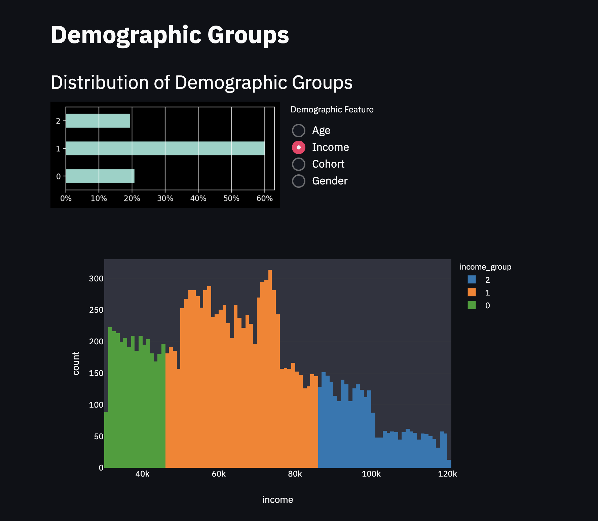

# Starbucks Capstone Project

## Project Motivation
This project was developed as part of the Udacity Data Scientist Nanodegree Capstone Project. Given a simulated dataset provided by Starbucks that mimics customer behavior on the Starbucks rewards mobile app, the task is to determine which demographic groups respond best to which offer type.

## Files Description
* `Starbucks_Capstone_notebook.ipynb` is the notebook for all the analysis and documentation of the developed solutions
* `app.py` contains the main code for running the web app
* `requirements.txt` contains list of dependencies for running the notebook and web app
* `docker-compose.yml` and `Dockerfile` are used to create the docker image to run the web app
* `utils` holds the utility functions used by the web app
    * `charts.py` contains code for creating the visualizations
    * `extract_transform.py` contains code for managing extraction and transformation tasks on the data
    * `inference.py` contains code for making the predictions
* `models` is the folder containing all fitted models used for inference
* `data` contains all the datasets used for the project (more details are provided in the notebook)
    * `portfolio.json`: containing offer ids and meta data about each offer (duration, type, etc.)
    * `profile.json`: demographic data for each customer
    * `transcript.json`: records for transactions, offers received, offers viewed, and offers completed


## Getting Started
### Running with Docker
To run the app, it suffices to have docker installed. Then, running the command bellow in the terminal inside the folder will build and start the docker image with the app. 
```
docker-compose up --build
```
If a web page doesn't automatically open up, type localhost:8501 in your browser. The app takes a few minutes to initialize.

Note: If you get the following message `starbucks-capstone_streamlit_1 exited with code 137`, try to increase the memory to around 8 GB.

### Running locally
You can also run the app locally without docker. For that, you'll need a basic installation of conda and the aditional packages listed in `requirements.txt` (plotly, xgboost, seaborn and streamlit).

After installing this libraries, you the running the following command in the terminal inside the folder will open the web app
```
streamlit run app.py 
```

## Project Conclusion

The problem addressed in this project is a really common task found in retail, but nonetheless difficult to model and get it right. In fact, most companies face dilemmas regarding marketing decisions such as which offer they should sent to which customers, how much reward, how long and how difficult should it be. These are hard questions that can must be addressed in order to survive in a highly competitive environment where data is becoming abundant and companies are getting more and more proficient in using them to decision making. At the same time offers help customers engange and spend, they also educate them in being more price sensitive. In case a company fails in providing effective offers to its customers, it will rapidly fade behind its competition or will have a hard time generating profit.

There are multiple ways this problem can be solved. The objective being to determine which demographic groups respond best to which offer type, two approaches were developped in this project.
1. **Descriptive Approach**
2. **Predictive Approach**

The response to an offer is defined as the amount each customer spends in the following days upon receiving it.

### Discussion of Results
In the Descriptive Approach, customers were segmented by their demographic information forming different groups. These were then evaluated in terms of how much they spent by each different offer type. This approaches offers the advantages that it's easier to create marketing campaigns to interpretable and "thematic" coarse customer groups; it may be better suited for new campaigns, where experts can make useful inputs to the offers; and also it makes it easy to report results and ensure stakeholders can grasp the idea and make the correct data driven decisions. However, this approach, doesn't really captures customer patterns and idiosyncrasies that may be useful for predicting their behaviour more accurately.

In the Predictive Approach, this is solved through feature engineering the events that each customer makes. This allows us to build a predictive model that captures more subtle patterns and accurately predicts how much each customer will spend when receiving different types of offers. That is to say that we can individually tailor the best offer to each customer based on his/her behaviour. The result is that, with this fine grained targetting, we avoid sending offers to customers who would have spent independently of receiving an offer, and we make sure that we send offers to customers who only buys when receiving relevant benefits. This can greatly improve the marketing campaign profit.

Finally, by creating a web app with both the solutions, the user can decide which solution provides the best method for he/her use case. Since it integrates interactive data visualizations, it also assists the user in analyzing the results in a faster way.

### Improvements
Multiple improvements could be made in this project, such as:
* **Choice of model, parameter grid, feature engineering**: the first improvement to be noted would be tweking the model to minimize the error of the predictive model (which is not good)
* **Target definition**: here the task was framed as a regression problem to infer how much the customer would spend in the period of the offer being sent. This could be changed to a classification problem, where we only try to predict if he/she will make a purchase. This will most likely increase the ability to predict, but we loose information that could be used to determine if the offer is worth it (i.e., the spending exceeds the amount of the reward the customer gets by completing the offer). Another possible improvement would be to, instead of having multiple targets, have one target and one aditional feature that informs the time window to predict the spending. This would be highly benefitial, since it would allow a continuous prediction and could be useful for designing new offers.
* **Problem structuring**: since the model was trained on a dataset filtered by events of offers received, it didn't learn to predict customer behaviour when no offers are given and are active. Including these "observational" samples in the training dataset would allow us to compare the strategy of sending each type of offer to the strategy of simply not sending any offer. Since customers may make purchases even while not receiving any offers, this would allow us to be much more efficient and the campaign to be more profitable.

## Using the Web App
The web app is divided in four sections

### Offers Portfolio
This sections gives a visual exploration of the portfolio of offers in two charts:
1. The offer funnel that contains the amount of offers received, viewed and completed
2. The distribution of different offer types and how they deviate from the uniform distribution


### Demographic Groups
This section gives an overview of the defined demographic groups used in the descriptive approach. It provides visualizations of the distribution of demographic groups based on different features.


### Offer Responsiveness - Descriptive Approach
This section provides the solution for determining the offers using a descriptive approach. It comprises of three subsections
1. Spendings per Demographic Feature: it shows how the response variable varies by groups of demographic feature and also by offer type
2. Best Demographic Groups per Offer: by selecting which features the user want to define demographic groups, an offer and the minimum sample size required inside each group, it returns a table containing the best groups to be targetted by the offer
3. Best Offer per Demographic Group: here we have the opposite. By defining a specific demographic group it returns the top 5 offers to be sent to them


### Offer Responsiveness - Predictive Approach
This last section provides the solution for determining the offers using a predictive approach. By selecting a specific customer and a time (after the last simulated time in the dataset), it predicts how much that customer will spend in different time windows for different offers. This allows the user to determine at the individual level the best offer to be sent.


## Acknowledgements
This project was developed as part of the Udacity Data Scientist Nanodegree Capstone Project and credit for making the dataset available goes to Starbucks.